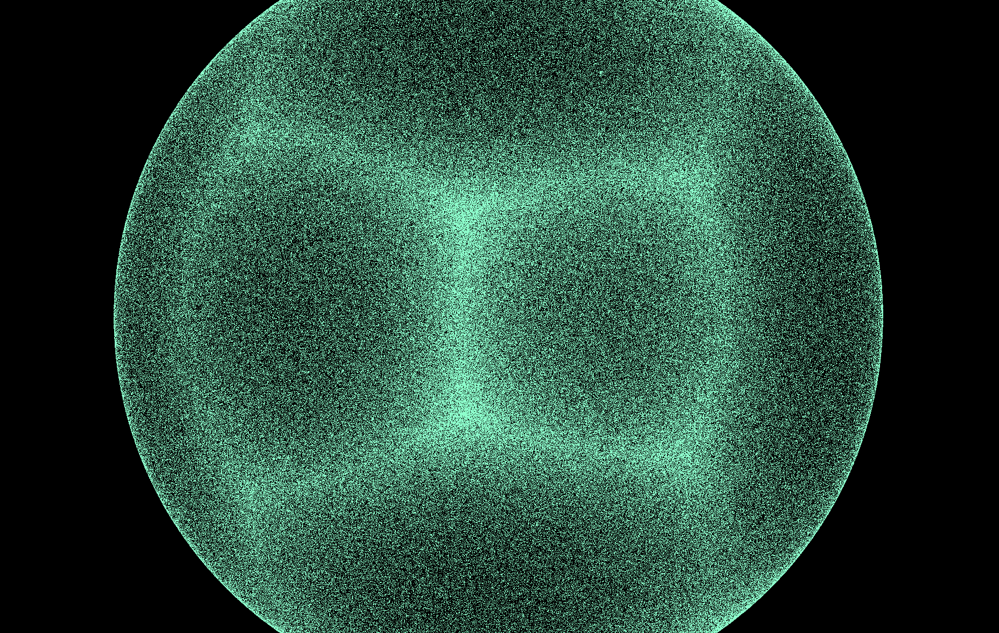
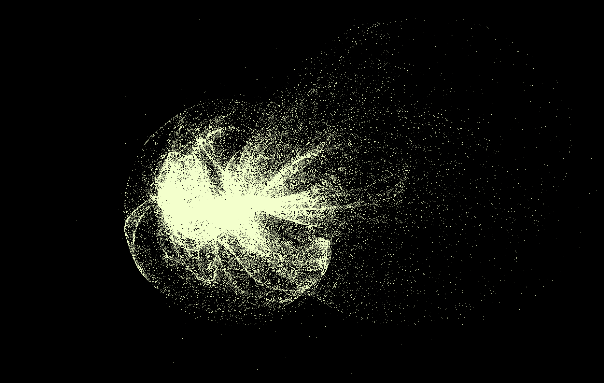

# 1 million particles
Transform Feedbackを利用したGPGPUパーティクルアニメーション。
下記サイトの作品をシンプルにしつつOpenGLに再実装したもの。

[WebGL Demo](https://wgld.org/s/webgl2/sample_015/)

[Transform Feedback解説](https://wgld.org/d/webgl2/w015.html)

## How to?
### 実行環境
* ubuntu 16.04 LTS
* OpenGL 3.0 mesa 18.05
* GLSL 1.2

### コンパイル方法
当該ディレクトリで
    $make
してください。